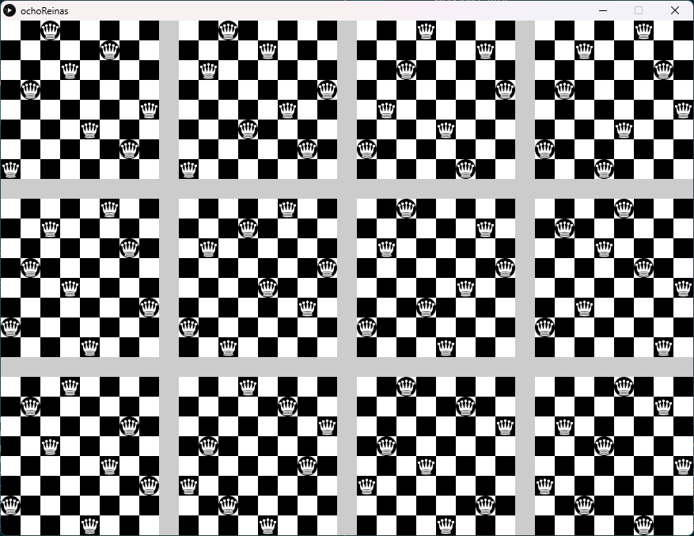

# [Eight Queens](https://en.wikipedia.org/wiki/Eight_queens_puzzle)
Solve the problem of placing eight chess queens on an 8×8 chessboard by graphing all fundamental solutions, where one fundamental solution represents all flipped and inverted versions.
 
1. You must install sbt and Scala, see [sbt](https://www.scala-sbt.org/) & [scala](https://www.scala-lang.org/)
1. Download source files from github:

`git clone https://github.com/AbuAwn/EightQueens.git`

3. execute sbt then run

Each board represents a solution for 8 possible ways, rotated or flipped, to place the Queen.
En total we have 96 possible solutions (12x8):

