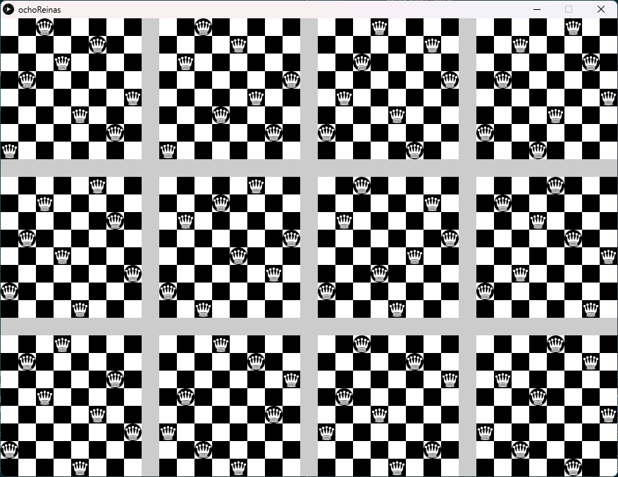

# [Eight Queens](https://en.wikipedia.org/wiki/Eight_queens_puzzle)
The Eight Queens problem is solved by graphing all fundamental solutions, where a fundamental solution represents all rotated and flipped versions of a placement of eight chess queens on an 8×8 chessboard.

To solve the problem, you must first install [sbt](https://www.scala-sbt.org/) and [scala](https://www.scala-lang.org/). Then, download the source files from GitHub using the following command:
 
`git clone https://github.com/AbuAwn/EightQueens.git`

Once the files are downloaded, you can run the program by executing the following command:

`sbt`

then

`run`

The program will print out a graph of all 92 possible solutions to the Eight Queens problem. Each board in the graph represents a fundamental solution, and each of the 8 possible ways to rotate or flip a fundamental solution is a variant of that solution.

Here is a breakdown of the terms used in the paragraph:

* Fundamental solution: A placement of eight chess queens on an 8×8 chessboard such that no two queens can attack each other.
* Rotated solution: A solution that is obtained by rotating the fundamental solution by 90, 180, or 270 degrees.
* Flipped solution: A solution that is obtained by flipping the fundamental solution horizontally or vertically.
* Variant: A rotated or flipped solution of a fundamental solution.
Note: Eleven of twelve fundamental solutions generate 8 variants each (through rotation and reflection), but one of them is symmetric under 180° rotation and therefore only generates 4 variants. this gives a total of `11 x 8 + 1 x 4 = 92` distinct solutions.

